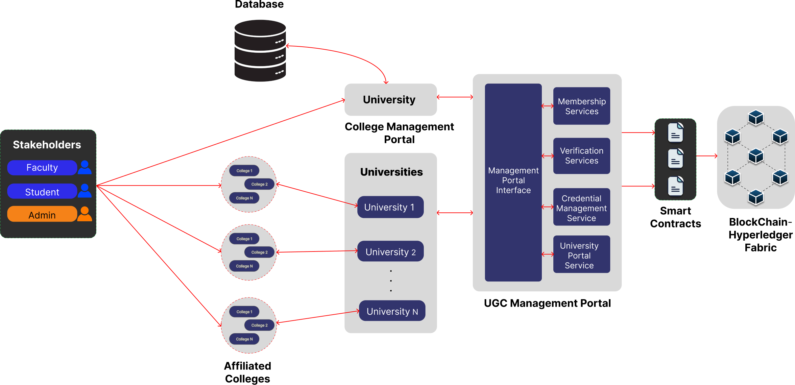

# EduChain: Hyperledger-Powered Decentralized University Services Management Framework

**EduChain** is a decentralized framework designed to manage university services securely and transparently. Leveraging **Hyperledger Fabric**, this project eliminates paper-based inefficiencies and prevents fraud in academic credentialing through a permissioned blockchain network.

## Abstract

In the current educational landscape, centralized databases are vulnerable to inefficiencies, errors, and security breaches, leading to a rise in fraudulent qualifications. EduChain addresses these challenges by implementing a decentralized, tamper-proof ledger where only accredited institutions can issue verifiable credentials.

The framework employs a **hybrid data architecture** to balance transparency with privacy: critical identity and accreditation data are stored on-chain, while granular logs (like daily attendance) remain off-chain, cryptographically linked via hashes.

### Key Components

* **UGC Management Portal:** Allows regulators to approve/reject university affiliations and monitor accreditation status.
* **College Portal:** Enables institutions to manage faculty, enroll students, and issue digital certificates.
* **Smart Contracts (Chaincode):** Automates logic for registration, grading, and credential issuance using Go.
* **Hybrid Storage:** Uses a local off-chain data store for heavy datasets (attendance/grades) while anchoring their integrity proofs on the blockchain.

## Overview

The system creates a tamper-proof ecosystem for:
* **Colleges:** To register and issue verifiable credentials.
* **Students:** To manage their identity and view grades.
* **Faculty:** To record attendance and grade phases securely.
* **Verifiers:** To publicly validate certificates without needing database access.

## Architecture & Design

The system is modeled as a permissioned network where the **UGC** acts as the root trust anchor, authorizing Universities and Colleges to participate.

The project follows a hybrid data approach:
1. **On-Chain (Blockchain):** Stores critical entities (Student Identity, College Accreditation, Final Certificates) and cryptographic hashes of off-chain data.
2. **Off-Chain (Local):** Stores granular details (Daily Attendance logs, Phase-wise Grade breakdowns) to preserve ledger performance and privacy.
3. **Verification:** Off-chain data is hashed and cross-referenced with the on-chain hash to ensure integrity.


*(Fig 1. Proposed Framework illustrating the interaction between Stakeholders, Portals, and the Hyperledger Fabric Network)*

## Prerequisites

This project relies on Bash scripts and Hyperledger Fabric binaries designed for Unix-based systems.

**Operating System:**
* **Linux** (Ubuntu/Debian recommended) OR
* **Windows** (Must use **WSL2** - Windows Subsystem for Linux) OR
* **macOS**

**Software:**
* **Docker** & **Docker Compose** (Daemon must be running)
* **Node.js** (v14 or higher)
* **Go** (v1.17 or higher)
* **Hyperledger Fabric Samples** (v2.4+ recommended)

## Project Structure

* **backend/**: Node.js Express application acting as the middleware API.
* **chaincode/**: Go Smart Contracts defining the business logic.
* **network/**: Scripts to bootstrap the Fabric test-network, deploy chaincode, and generate crypto-material.

## Installation & Setup

Follow these steps to set up the environment from scratch.

### 1. Install Hyperledger Fabric

You must have the Fabric Binaries and the `fabric-samples` repository installed. Run the following command in your workspace directory (parent folder):

```bash
# Download Fabric Docker images, binaries, and samples (v2.5.x)
curl -sSL https://bit.ly/2ysbOFE | bash -s -- 2.5.9 1.5.12
```

### 2. Clone the Repository

```bash
git clone https://github.com/SuyogAM1116/educhain_project.git
cd educhain_project
```

### 3. Start the Network & Generate Identities

We have provided a unified script that:
1. Starts the Hyperledger Fabric Test Network (with CouchDB and CAs).
2. Deploys the `educhain` Smart Contract.
3. Automatically registers users (User1, Admin).
4. **Generates and copies the required crypto-keys into the backend wallet.**

1. Open `network/deploy.sh` and ensure `TEST_NETWORK_DIR` points to your `fabric-samples` location.
2. Run the script:

```bash
cd network
chmod +x deploy.sh
./deploy.sh
```
**Note: This script performs manual key generation using fabric-ca-client to simulate a real-world MSP setup. It automatically populates the backend/wallet directory, so you do not need to run separate enrollment scripts.**

### 4. Backend Setup

Navigate to the backend directory and install dependencies.

```bash
cd ../backend
npm install
```

## Configuration (Critical)

While the deployment script handles the network and keys, you must ensure the application code points to the correct wallet location on your machine.

### Update Wallet Paths

The application code references a specific wallet directory. You must update this path to match your machine.

1. Open `controllers/studentController.js` (and similarly `facultyController.js`, `collegeController.js`, `verificationController.js`).
2. Find the `connectToNetwork` function.
3. Locate the line defining `walletPath`.
4. Change the path to point to the `wallet` folder inside your `backend` directory.

**Change this:**
```javascript
const walletPath = path.resolve('/home/Fabric/educhain-backend/wallet');
```
**To this (recommended for portability):**
```javaScript
const walletPath = path.join(process.cwd(), 'wallet');
```

## Running the Application

Once the network is up and the paths are configured, start the backend server:

```bash
node app.js
```

The server will run on Port 5000.

## API Endpoints

### College Management

| Method | Endpoint | Description |
| :--- | :--- | :--- |
| POST | `/api/colleges/register` | Register a new college application |
| POST | `/api/colleges/admin/approve/:id` | Approve a college (Admin Only) |
| GET | `/api/colleges/certificate/:id` | View College Accreditation Certificate |

### Faculty Services

| Method | Endpoint | Description |
| :--- | :--- | :--- |
| POST | `/api/faculty/register` | Register new faculty member |
| POST | `/api/students/attendance` | Mark student attendance for a course |
| POST | `/api/students/grades` | Upload student grades (Phase 1/2/Final) |

### Student Services

| Method | Endpoint | Description |
| :--- | :--- | :--- |
| POST | `/api/students/register` | Enroll a new student |
| POST | `/api/students/certificate/issue` | Issue a Course Certificate |
| GET | `/api/students/query/:id` | View Student Profile |

### Public Verification

| Method | Endpoint | Description |
| :--- | :--- | :--- |
| GET | `/api/verification/college/:id` | Verify College Validity |
| GET | `/api/verification/student/certificate/:id` | Verify Student Certificate by ID |

## Smart Contract Data Model

The Chaincode (Go) defines the following assets:

* **Student:** ID, Name, Branch, Grades (Map), Attendance (Map).
* **College:** ID, Name, AccreditationStatus, ApplicationStatus.
* **Certificate:** CertificateID, TransactionID, and OffChainDataHash.


## Security & Role-Based Access Control (RBAC)

EduChain implements strict RBAC to prevent unauthorized data modification:

* **UGC Admins:** Can accredit or reject colleges.
* **Faculty:** Can only update grades for students within their own college/department.
* **Students:** Have read-only access to their own records.


## Future Work

The current implementation utilizes the Hyperledger Fabric Test Network. Future phases will involve migrating to a multi-system production network with distributed peer nodes for enhanced scalability and integrating Hyperledger Explorer for network monitoring.

## Limitations

* **Data Persistence:** Detailed attendance and grade logs are currently stored in an in-memory structure (`offChainDataStore.js`). Restarting the backend will reset this specific data, though on-chain certificates remain permanent.
* **Authentication:** Basic authentication is handled via a local JSON file (`user_credentials.json`).

## License

Distributed under the MIT License.
